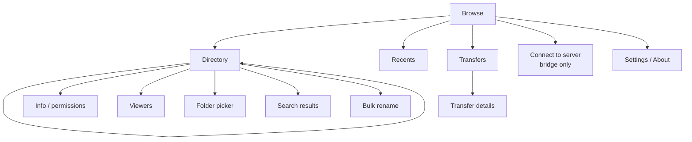

# Lautta — SPEC

*Lautta* (Finnish: ferry) is a working title. `harbour-lautta`, `org.netvfs` and
`lautta` below are placeholders and can be renamed in one pass.

Status: draft 2. Target: Sailfish OS 5.2+, aarch64 only, distributed through Jolla Harbour
only. Remote locations come from netvfs v2 through its bridge (`netvfs/SPEC.md` §8a,
requirement IDs `XB-*`) when that is installed; the app is complete and Harbour-compliant
without it.

Requirement prefixes: `HBR` Harbour compliance, `ARC` architecture, `RS` Rust,
`NVB` netvfs bridge integration, `LOC` locations, `BRW` browsing, `OPS` file operations,
`XFR` transfers, `PRV` preview, `EDT` editing, `SRC` search, `SYN` sync, `ORG`
favourites/recents/tags, `INT` system integration, `UI` interface, `SEC` security,
`PRF` performance, `DAT` persistence, `TST` testing, `PKG` packaging. "Must" is a
requirement, "should" a default that may be revisited with a recorded reason, "may"
optional.

## 0. Changes since draft 1

| Draft 1 | Draft 2 |
|---|---|
| OpenRepos/Chum, unsandboxed, Harbour collisions accepted | Harbour only, Harbour-compliant by default, sandboxed with the smallest permission set |
| aarch64 + armv7hl + emulator | aarch64 only |
| C++ app linking libnetvfs | Rust app; never links netvfs |
| `lauttad` daemon, systemd unit, D-Bus service, transfer-engine plugin | single process, no daemon, no system integration files outside Harbour's paths |
| Whole host file system, Root location | user folders and removable media only |
| Built-in protocol stack via netvfs plugins in-process | remote access only through the netvfs bridge, over a socket in the app's own data folder, with file descriptors for local data |
| Accounts created in-app with netvfs QML | account management handed off to Settings via the bridge |
| Share plugin via transfer-engine | `ShareProvider` (Sailfish.Share) share target |

## 1. Summary

A file manager for Sailfish OS in the spirit of the iOS Files app with the transfer
capabilities of Transmit or Cyberduck. On its own it manages the user's files: Documents,
Downloads, Pictures, Music, Videos, Public, the Android storage folders Sailjail exposes, SD
cards and USB drives. When netvfs v2 with its bridge is installed, the same app also
browses every SFTP, SMB, WebDAV and FTP/FTPS server configured in Settings → Accounts.
Those servers become ordinary locations: browse, preview, stream, edit in place, copy and
move between any two of them, with a persistent, resumable queue.

The app is a Rust program with a Silica QML UI. It is a single sandboxed process.

## 2. Goals, non-goals, principles

### 2.1 Goals

1. Pass Harbour intake with no exceptions, warnings only where unavoidable and documented
   (§3).
2. Feature parity with Harbour File Browser inside the same sandbox (Appendix A).
3. When netvfs v2 is present: remote locations as first-class as local ones, with a
   desktop-class transfer engine.
4. Edit remote files in other apps with write-back; preview and play media without
   leaving the app.
5. Never lose data; never fail open on security; never show the user a decision the
   platform could make safely.

### 2.2 Non-goals

- The host file system outside the user's folders and removable media. That is the
  platform's business.
- Any network protocol implemented in the app. All remote access goes through netvfs.
- Background operation after the app is closed. No daemons, no services.
- Root mode, account creation inside the app, share links, cloud OAuth providers.
- Any distribution channel other than Harbour; any architecture other than aarch64.

### 2.3 Principles

- Minimal permissions. Every permission in the desktop file has a feature that needs it
  and a line in §3.3 saying which.
- The sandbox is a feature. The app never asks netvfs to touch local paths on its behalf;
  it hands over file descriptors it opened itself (NVB-9).
- Silica first. Pulley menus, remorse timers, attached pages, cover actions.
- Latency is a feature. Cached listings show instantly; transfers never make browsing
  wait.
- One engine, many locations. Capability flags, not provider names, decide what the UI
  offers.

## 3. Platform and Harbour compliance

### 3.1 Target

| Item | Value |
|---|---|
| OS | Sailfish OS 5.2 or later |
| Architecture | aarch64 only (`ExclusiveArch: aarch64`) |
| UI | Qt 5.6, Silica, QML |
| Logic | Rust (§6), edition and MSRV fixed to the rustc in the 5.2 SDK target |
| Build | Sailfish SDK (`sfdk`), cargo inside the scratchbox2 target |
| Package | `harbour-lautta-<version>-<release>.aarch64.rpm` |
| Distribution | Jolla Harbour only |
| Licence | to decide (§24); clean-room, no Harbour File Browser code reuse |

### 3.2 Harbour rules the design depends on

Taken from `sailfishos/sdk-harbour-rpmvalidator` as of commit `7dd7dd5` (2026-09-10).
CI runs that validator on every package (TST-7); this table is a summary, the validator
is the authority.

- HBR-1: Package name `harbour-lautta`; files only at `/usr/bin/harbour-lautta`,
  `/usr/share/harbour-lautta/**`, `/usr/share/applications/harbour-lautta.desktop`, and
  the icon paths. No systemd units, D-Bus service files, account files, transfer-engine
  plugins, or files in `/etc`.
- HBR-2: Dynamic libraries only from the allowed list. The app links exactly:
  `libc`, `libm`, `libpthread`, `libdl`, `librt`, `libgcc_s`, `libstdc++` (Qt glue),
  `libQt5Core`, `libQt5Gui`, `libQt5Qml`, `libQt5Quick`, `libQt5Multimedia`,
  `libsailfishapp`, `libsqlite3`, `libz`, `liblzma`, `libbz2`. No other `.so`, no bundled
  `.so` files (everything else is statically linked Rust), no RPATH.
- HBR-3: QML imports only from the allowed list: `QtQuick 2.6`, `QtQml.Models 2.2`,
  `Sailfish.Silica 1.0`, `Sailfish.Share 1.0`, `Sailfish.Pickers 1.0`,
  `Nemo.Notifications 1.0`, `Nemo.KeepAlive 1.2`, `Nemo.Thumbnailer 1.0`,
  `Nemo.Configuration 1.0`, `QtMultimedia 5.6`. App-private QML modules live under
  `/usr/share/harbour-lautta/qml` and use a non-reserved URI (`Lautta.*`).
- HBR-4: The binary exports `main` (the validator errors otherwise for Silica apps) and
  links `__libc_start_main@GLIBC_2.34` (expected version on aarch64). The desktop file
  sets `X-Nemo-Application-Type=silica-qt5`.
- HBR-5: `[X-Sailjail]` uses only `Permissions`, `OrganizationName`, `ApplicationName`,
  `ExecDBus`. `OrganizationName` must not be `com.jolla` or `org.sailfishos`.
- HBR-6: No setuid/setgid bits, no debug info in the package, no source-control files.
- HBR-7: The app must not spawn other programs. Sailjail's `private-bin` only provides
  the app's own binary, so the design contains no subprocesses at all.

### 3.3 Sandbox profile

```ini
[X-Sailjail]
OrganizationName=org.netvfs
ApplicationName=lautta
Permissions=UserDirs;RemovableMedia;Audio
ExecDBus=harbour-lautta
```

| Permission | Why | What it grants (sailjail-permissions) |
|---|---|---|
| `UserDirs` | the user's files | `~/Documents`, `~/Downloads`, `~/Pictures`, `~/Music`, `~/Playlists`, `~/Videos`, `~/Public`, and `~/android_storage/{Documents,Download,Pictures,DCIM,Music,Podcasts,Movies}` |
| `RemovableMedia` | SD cards and USB drives | `/run/media` (via `ignore disable-mnt`), listening to UDisks2 signals |
| `Audio` | sound in audio/video preview | PulseAudio, GStreamer cache |

Not requested, on purpose: `Internet` (the app never opens network sockets; netvfs does —
see PRV-9 for the one feature that was redesigned to avoid it), `Accounts` and `Secrets`
(credentials stay inside netvfs), `MediaIndexing` (optional later, SRC-5), `Compatibility`.

Implicit: `~/.local/share/org.netvfs/lautta`, `~/.cache/org.netvfs/lautta`,
`~/.config/org.netvfs/lautta`, and ownership of D-Bus name `org.netvfs.lautta` (used for
notification actions and `ExecDBus` activation).

### 3.4 Two modes

| | Standalone (Harbour default) | With netvfs v2 bridge |
|---|---|---|
| Locations | user folders, Android folders, removable media, archives | + every netvfs account with *Files* enabled, ad-hoc servers, Nearby |
| Network | none | none in the app; the bridge does it |
| Credentials | none | never seen by the app for saved accounts; typed-in secrets for ad-hoc servers are passed once and wiped |
| UI differences | no *Servers* section, no *Connect to server* | full |
| Detection | socket absent | socket present at NVB-1 path and handshake succeeds |

The app must be useful and polished in standalone mode. Harbour reviewers will mostly
see that mode; the store description mentions network locations neutrally ("works with
network locations provided by netvfs, if installed") and never as the main feature
(risk R-1).

## 4. Glossary

| Term | Meaning |
|---|---|
| Location | Something browsable with a root: a user folder, an Android folder, a removable volume, a netvfs account, an ad-hoc server, an archive. Stable `locationId`. |
| Provider | Rust implementation behind locations: `local`, `netvfs`, `archive`. |
| Bridge | netvfs's `netvfs-bridge` process serving this app over a unix socket (netvfs XB-*). |
| Account | A netvfs account with the *Files* service enabled, as exposed by the bridge. |
| Ad-hoc location | A server opened via *Connect to server*; lives in the bridge for this app only. |
| Operation | A user-level action (copy 37 items to X), planned into steps. |
| Transfer | An operation that moves bytes; persisted in the queue. |
| Working copy | A local copy of a remote file opened in another app, watched for write-back. |

## 5. Architecture

### 5.1 Overview

```mermaid
flowchart LR
  subgraph APP["harbour-lautta (sandboxed, one process)"]
    QML[Silica QML] --> QT[Qt glue: qmetaobject-rs<br/>models, QObjects]
    QT --> CORE[lautta-core (Rust)]
    CORE --> LP[local provider]
    CORE --> AP[archive provider]
    CORE --> NP[netvfs provider<br/>zbus p2p client]
    CORE --> DB[(SQLite: queue, caches,<br/>prefs, recents, tags)]
  end
  NP <-- "unix socket in app data dir<br/>p2p D-Bus + fd passing" --> BR[netvfs-bridge<br/>(not part of this app)]
  BR --> NV[(libnetvfs v2 + backends)]
  NV <--> S[(SFTP / SMB / WebDAV / FTP servers)]
  LP --> FS[(user folders, /run/media)]
```

- ARC-1: One process. No helper binaries (HBR-7), no daemon (HBR-1). Work that must
  outlive a page lives in `lautta-core`; work that must outlive the process is persisted
  and resumed at the next start (XFR-11).
- ARC-2: `lautta-core` has no Qt dependency. It is testable on the host with
  `cargo test`, including against a fake bridge (TST-2).
- ARC-3: `lautta-qt` exposes core to QML with `qmetaobject-rs`: list models, QObject
  facades, image providers. It contains no business logic.
- ARC-4: Providers implement one async trait (Appendix B). The UI and the operation
  planner see only `Provider` + `Capabilities`; there are no provider-specific branches
  above the provider layer.

### 5.2 Threads and runtimes

- ARC-5: The Qt GUI thread owns every QObject and model. Core never touches QObjects;
  results return through `qmetaobject::queued_callback` closures.
- ARC-6: A tokio multi-thread runtime with 2 worker threads runs orchestration, the
  bridge client and the transfer scheduler. Local file system calls run on
  `spawn_blocking` with a semaphore of 4 (a slow SD card must not starve the runtime).
- ARC-7: CPU-heavy work (thumbnail decoding, hashing, decompression) runs on
  `spawn_blocking` behind a separate semaphore of `max(1, cores − 2)`.
- ARC-8: Sorting and filtering of listings run in core (off the GUI thread) and are
  delivered as index permutations plus diffs, so the GUI thread only applies
  `beginInsertRows`/`dataChanged` batches.

### 5.3 Core components

| Component | Responsibility |
|---|---|
| `LocationRegistry` | user folders that exist and are readable, removable volumes (UDisks2 signals + `/run/media/$USER`), bridge locations, archives |
| `BridgeClient` | socket discovery, handshake, consent state, reconnect, request/response and job plumbing (§7) |
| `Scheduler` | per-location lanes (interactive / bulk / stream) mapped to bridge lane hints or local semaphores |
| `Planner` | expands operations into steps, scans, detects conflicts |
| `TransferQueue` | persistent queue and history in SQLite, resume bookkeeping |
| `DirCache` | memory LRU + SQLite listing cache, stale-while-revalidate |
| `Thumbs` | local thumbnails via `Nemo.Thumbnailer`; remote thumbnails decoded in Rust |
| `MediaSource` | random-access byte source for the player (PRV-9) |
| `WorkingCopies` | edit-in-place copies, inotify watches, write-back |
| `Trash` | app-private *Recently deleted* for local files |
| `Questions` | blocking prompts (conflicts, ad-hoc identity, keyboard-interactive) |

## 6. Rust

### 6.1 Decision record

Rust was chosen unless a strong reason spoke against it. The candidates were checked:

| Concern | Finding | Verdict |
|---|---|---|
| Qt 5.6 bindings | `qmetaobject-rs` supports Qt ≥ 5.6 (build script refuses older), is maintained (2026 commits), and has been used for Silica apps | fine; pin a commit |
| Toolchain in the SDK | Sailfish packages rustc/cargo with scratchbox2 patches (`sailfishos/rust`, tags 1.75 and 1.95) | fine; MSRV = the 5.2 target's rustc (verify which, §24.1) |
| Harbour ELF checks | Rust binaries link only libc/libm/libpthread/libdl/librt/libgcc_s; need an exported `main` | fine with RS-3 |
| netvfs is C++/Qt | the app no longer links netvfs (Harbour forbids its dependencies); the boundary is a socket protocol | Rust is no worse than C++ here |
| C++ glue needed | SailfishApp bootstrap, `QMediaPlayer` with a `QIODevice`; both small, via the `cpp` crate inside `lautta-qt` | acceptable, contained |
| Booster | mapplauncherd `silica-qt5` booster loads the binary as a PIE and calls `main` | needs device verification (§24.1), fallback in RS-3 |

No strong reason against was found. Residual risks: booster compatibility and crate MSRV
against the target rustc.

### 6.2 Requirements

- RS-1: Cargo workspace: `lautta-core` (no Qt), `lautta-qt` (qmetaobject-rs, `cpp`),
  `lautta-bridge-proto` (bridge types and the D-Bus interface, shared with the fake
  bridge used in tests), `harbour-lautta` (binary).
- RS-2: Native linkage only to HBR-2 libraries. `cargo-deny` enforces an allow-list of
  crates with `links =` keys and of licences. Preferred pure-Rust backends: `zbus`
  (no libdbus), `miniz_oxide` via `flate2`, `zip`, `tar`, `image` (jpeg, png, gif, webp),
  `kamadak-exif`, `pulldown-cmark`, `notify` (inotify), `rustix` (renameat2, statx,
  copy_file_range). `rusqlite` links the system `libsqlite3.so.0`; `xz2` and `bzip2` link
  the system `liblzma`/`libbz2`. zstd, if used, is linked statically.
- RS-3: Binary: `#![no_main]`, `#[no_mangle] pub extern "C" fn main(argc, argv)`, linked
  with `-Wl,--export-dynamic-symbol=main`, PIE. Arguments come from `main`'s parameters,
  not `std::env::args`, so booster launch behaves like a direct launch. If the booster
  cannot load the binary, the fallback is `X-Nemo-Application-Type=qt5` with direct
  `SailfishApp` start (validator warning only, documented).
- RS-4: `panic = "abort"` in release. Every closure invoked from C++ is a thin trampoline
  that cannot unwind. Crashes write a minidump-free text report to the cache folder
  (`panic` hook), shown at the next start with *Copy report*.
- RS-5: `unsafe` is allowed only in `lautta-qt` (FFI) and in a single `sys` module of
  `lautta-core` (fd passing, `statx`, `renameat2`). `#![forbid(unsafe_code)]` elsewhere.
- RS-6: Dependencies are vendored (`cargo vendor`) and `Cargo.lock` is committed;
  builds inside sfdk never touch the network.
- RS-7: Release profile: `lto = "fat"`, `codegen-units = 1`, `opt-level = 3`, `strip =
  "symbols"` (the validator rejects debug info). Binary size budget: ≤ 20 MB stripped.
- RS-8: Error model: `lautta_core::Error` mirrors the netvfs v2 taxonomy one-to-one
  (`AuthFailed`, `ServerIdentityChanged`, `NotFound`, `Locked`, …) plus local `io`
  mappings, so the UI has one message table (§20) for every provider.

## 7. netvfs bridge integration

The bridge is specified normatively in `netvfs/SPEC.md` §8a (XB-*). This section states
what the app does.

- NVB-1: Discovery: the app checks for the socket
  `~/.local/share/org.netvfs/lautta/netvfs/bridge.sock` at start, when returning to the
  foreground, and when inotify reports it created. Absent socket → standalone mode
  without any message. The app never creates that directory or file.
- NVB-2: Connection: peer-to-peer D-Bus (`zbus`, unix socket transport with fd passing),
  interface `org.netvfs.Bridge1`. First call `Hello(protocol, clientVersion)`; if the
  bridge's protocol is older than the app needs, network locations stay hidden and
  *About* says "Network locations need a newer netvfs".
- NVB-3: Consent: until the bridge reports consent `granted`, the *Servers* section shows
  one row "Allow access in the notification from netvfs" with *Ask again*
  (`RequestConsent`). `denied` hides the section and shows the reason in *About*.
- NVB-4: Locations: `ListLocations` and `LocationsChanged` populate *Servers* (accounts
  and this app's ad-hoc servers) and *Nearby* (`Discover`). Attention states from netvfs
  (`auth-failed`, `server-identity-changed`) show as badges.
- NVB-5: Account management is handed off: *Add server* → `AddAccount(provider)`;
  *Edit*, *Update sign-in*, *Review server identity* → `OpenAccountSettings(id)`. The bridge
  opens Settings; the app never edits accounts, pins or secrets.
- NVB-6: Ad-hoc servers: *Connect to server* collects a URL and, when needed, a secret,
  and calls `ConnectAdHoc`. The secret buffer is zeroized (`zeroize`) immediately after
  the call. Identity prompts for ad-hoc servers arrive as `Question` signals and are
  answered in the app; for accounts they never are (NVB-5).
- NVB-7: Requests: namespace operations, stat, list (batched signals), handles, server
  copy, checksums and space info map one-to-one to bridge methods. Every request carries
  a lane hint (`interactive`, `bulk`, `stream`); the bridge owns connection pools.
- NVB-8: Names and paths cross the bridge as byte strings (`ay`), never `s`, because
  netvfs names may contain bytes that are not UTF-8 (netvfs XC-4) and D-Bus strings must
  be valid UTF-8. In Rust they are a `RemotePath(Vec<u8>)` newtype; display uses lossy
  decoding with a badge (BRW-1).
- NVB-9: Local data never travels by path. For uploads the app opens the local file
  read-only and passes the fd; for downloads it creates the destination temporary file
  (O_EXCL, NVB-11 naming) and passes a writable fd; for streams from archives or
  compressors it passes one end of a pipe. The bridge must use `pread`/`pwrite` at
  explicit offsets (netvfs XB-11), so the app may keep using its own copy of the fd for
  size checks.
- NVB-10: Jobs (`Upload`, `Download`, `CopyAcross`, `RemoveTree`, `Walk`) report
  `JobProgress` (≤ 4 Hz) and `JobFinished`. The app persists job intent in its queue before
  starting a job, so a crash or bridge restart never loses track of a transfer.
- NVB-11: Temporary names: `.<name>.lautta-<shortid>.part` for both local and remote
  destinations, passed to the bridge as the upload target; the final rename is a separate
  `Rename(NoReplace or Replace)` call. Backends reporting `AtomicPut` (WebDAV) are written
  directly.
- NVB-12: Failure handling: socket EOF or `ConnectionLost` → all bridge locations show
  "Reconnecting…"; the app reconnects with backoff (1, 2, 4, 8 s, then 15 s) while in the
  foreground; running transfers become *waiting* and resume (XFR-12). The bridge cancels
  jobs of a disconnected client itself (netvfs XB-13).

## 8. Locations

- LOC-1: User folders: Documents, Downloads, Pictures, Music, Videos, Public, Playlists;
  each shown only if it exists and is readable. There is no "Home" or "Root" location
  (the sandbox would show an incomplete tree, which the old File Browser had to explain).
- LOC-2: Android storage: one *Android* group listing the exposed subfolders (Documents,
  Download, Pictures, DCIM, Music, Podcasts, Movies) that exist.
- LOC-3: Removable volumes: from UDisks2 signals plus a scan of `/run/media/$USER/*`;
  appear and disappear live. Mount, unmount and format are not available to sandboxed
  apps; the app shows *Open Storage settings* instead (verify the handoff, §24.1).
  Transfers to a vanishing volume pause with "Insert the card to continue".
- LOC-4: netvfs accounts and ad-hoc servers (NVB-4, NVB-6).
- LOC-5: Archives opened as read-only locations (PRV-11).
- LOC-6: Nearby servers from the bridge's discovery; tapping prefills *Connect to
  server*; nothing connects automatically.
- LOC-7: Internal URI `lautta://<locationId>/<path>` (path bytes percent-encoded).
  `locationId`: `user-documents`, …, `android-dcim`, `vol-<uuid>`, `nv-<bridge id>`,
  `arc-<hash>`. Display/copy address: `file://` for local, the netvfs URL from the bridge
  for remote (secrets never included).

## 9. Browsing

- BRW-1: `DirectoryModel` roles: name (lossy display), nameIsLossy, type, isDir (follows
  symlink target type when known), isSymlink, size, modified, created, mode, owner,
  group, flags (hidden, readonly), mimeType (extension, plus magic sniffing for local
  files), icon, thumbnail, selected, transferState.
- BRW-2: Sorting: natural, case-insensitive name order (a natural-sort comparator over
  lowercased NFC text with a byte-order tiebreak; full ICU collation is not worth its size
  in the binary), size, modified, type; folders first toggle; stable.
- BRW-3: Instant filter (substring, case- and diacritics-insensitive), hidden files
  toggle (dot names and the hidden attribute), type chips.
- BRW-4: Per-folder view settings persisted per URI, inheriting location then global
  defaults (File Browser parity).
- BRW-5: Stale-while-revalidate: cached listing shown immediately (≤ 7 days old, marked
  stale), refresh on the interactive lane, diff applied in place without losing scroll
  or selection.
- BRW-6: Local folders are also watched with inotify while open, so changes made by other
  apps appear without a refresh.
- BRW-7: Offline: cached remote folders remain browsable read-only with a banner.
- BRW-8: Large folders: listings arrive in batches and render as they arrive; above
  20 000 entries the view falls back to name order, no sections, thumbnails off.
- BRW-9: Path menu from the page header: ancestors, *Copy address*, *Edit path* with
  completion from the cache.
- BRW-10: Symlinks in local folders that point outside the sandbox show as "Not
  accessible" rather than as empty folders.

## 10. File operations

### 10.1 Catalogue

| Operation | Local (sandbox) | netvfs location | Notes |
|---|---|---|---|
| New folder / empty file | ✓ | ✓ | exclusive create |
| Rename, bulk rename | ✓ | ✓ | no-replace by default |
| Copy / move within location | ✓ (reflink/`copy_file_range`, rename) | server copy if capable, else via bridge | |
| Copy / move across locations | ✓ | ✓ | queue |
| Delete | ✓ to *Recently deleted* | ✓ remorse, permanent | |
| Symlink / hard link | ✓ (same volume, not on vfat/exFAT) | if capable | |
| Permissions | ✓ (not on vfat/exFAT) | if capable | |
| Set modification time | ✓ | if capable | |
| Compress / extract | ✓ | ✓ streamed through pipes (NVB-9) | |
| Checksums | ✓ | if capable, else streamed and hashed locally | |

The UI reads capabilities (local: per filesystem type via `statfs`; remote: from the
bridge).

### 10.2 Semantics

- OPS-1: Plan first: recursive scan, totals, conflicts. Plans over 1 000 items or 1 GB
  show a summary sheet; smaller plans start at once.
- OPS-2: Conflict choices: *Replace*, *Skip*, *Keep both* (`name 2.ext`…), *Merge*
  (folders), *Replace if newer*, *Resume* (only when the destination supports it and the
  partial file is a prefix by size); "apply to all remaining". The default is never
  *Replace*.
- OPS-3: Case-only renames on case-insensitive locations (vfat/exFAT, SMB, capability
  flag) go through an intermediate name.
- OPS-4: Moves across locations: copy, verify, delete source, per file.
- OPS-5: Preserve modification times (default on); POSIX modes only when both sides
  support them and the user enabled it; never ownership.
- OPS-6: Symlinks: copied as links where the destination supports them and both sides
  are the same kind; otherwise the target is copied; loops detected (device+inode
  locally, visited set remotely), depth limit 40.
- OPS-7: Names invalid on the destination (vfat/exFAT and SMB rules, length) get a
  proposed safe name in the plan, acceptable for all.
- OPS-8: Delete: remorse timer (5 s, 3–10 s setting). Local deletes on the home
  filesystem move items to *Recently deleted* (`~/.local/share/org.netvfs/lautta/trash`,
  same filesystem, so a rename) and are purged after 30 days; on removable media and
  remote locations deletes are permanent and say so.
- OPS-9: Undo for the last rename, same-location move and trash operation, from a banner
  for 10 s.
- OPS-10: Clipboard (cut/copy, docked paste bar) and *Copy to…*/*Move to…* folder picker
  across all locations.
- OPS-11: Bulk rename: find/replace (plain, regex), prefix/suffix, numbering, case,
  extension, date patterns; live preview with collision and validity checks.
- OPS-12: Info page and permissions editor (rwx grid, octal, recursive with separate
  file/folder masks).

## 11. Transfers

- XFR-1: Every byte-moving operation is a transfer with items and states: queued,
  scanning, running, paused, waiting (bridge/network/question/volume), failed, completed,
  canceled.
- XFR-2: Scheduling: FIFO per destination, round-robin across locations, reorder, pause,
  resume, cancel, retry. Concurrency: local 2, per netvfs location 2 (bulk lane, user
  range 1–6).
- XFR-3: Data paths:
  - local → local: Rust; same filesystem rename for moves, `FICLONE` →
    `copy_file_range` → buffered copy.
  - local → remote: `Upload` with the source fd.
  - remote → local: `Download` into the destination temp fd, then `fsync`, size check,
    `renameat2(RENAME_NOREPLACE)` (or replace if chosen).
  - remote → remote, same location: server copy if capable, else `CopyAcross`.
  - remote → remote, different locations: `CopyAcross` (the bridge pipes between its two
    connections).
  - archive → anywhere: decompress into a pipe whose read end is the upload fd.
- XFR-4: Verification: size always; checksum when cheap on both sides or the user
  enabled "Verify with checksums" (default off, on for moves).
- XFR-5: The app holds `KeepAlive { enabled: true }` (`Nemo.KeepAlive 1.2`) while any
  transfer runs, so the device does not suspend mid-transfer.
- XFR-6: Closing the app stops transfers. If transfers are running, the close gesture is
  not intercepted (the platform does not allow it), so the cover and a notification say
  "3 transfers will resume when you open Lautta again" once the app is closed with work
  pending (written at shutdown, shown as a persistent notification by `Nemo.Notifications`).
- XFR-7: Network policy is the bridge's (netvfs decides per account); the app only
  surfaces "Waiting for network".
- XFR-8: Progress: per item and aggregate bytes, smoothed rate, ETA; shown in the
  Transfers page, on the cover, and in one updating notification while the app is in the
  background.
- XFR-9: Failure policy: transient errors retry 3 times per item with backoff; then the
  item fails and the rest continue; "Completed with N failures" with *Retry failed*.
- XFR-10: History kept 30 days (setting).
- XFR-11: Persistence: queue state written on every state change and at most every 2 s of
  progress. At start, unfinished transfers come back paused with *Resume* (auto-resume
  setting, default on when the bridge is reachable).
- XFR-12: Resume: the committed offset is the size of the temporary file (local: `fstat`;
  remote: `Stat` through the bridge). Remote destinations resume with
  `Upload(disposition=Resume)` when capable, otherwise restart that file. Downloads
  always resume.

## 12. Preview, open, stream, edit

- PRV-1: Local thumbnails via `Nemo.Thumbnailer` (`image://nemoThumbnail/` and the
  `Thumbnail` item), covering images and videos the system can thumbnail.
- PRV-2: Remote image thumbnails: read the first 64 KiB through the bridge, use the EXIF
  thumbnail when present; otherwise read the whole file up to 20 MB (5 MB when the bridge
  reports a metered network) and decode with the `image` crate at the target size, EXIF
  orientation applied. Cache in `~/.cache/org.netvfs/lautta/thumbs` (key: URI, size,
  mtime, etag), 200 MB LRU.
- PRV-3: Thumbnail jobs: interactive lane, lowest priority, ≤ 2 in flight per location,
  visible delegates only, canceled on scroll.
- PRV-4: Viewers: images (zoom, swipe through the folder, EXIF panel), text/code (read-
  only up to 1 MiB, then a notice), Markdown (pulldown-cmark → Qt rich text subset), audio
  and video (QtMultimedia), archives (as locations), SQLite (local files, read-only,
  tables and first rows), hex view (ranged reads). No PDF viewer: poppler is not allowed;
  PDFs go to *Open with*.
- PRV-5: *Open with* for local files uses the system handler as Harbour File Browser
  does (mechanism to verify in the sandbox, §24.1).
- PRV-6: Remote files opened in another app must be readable by that sandboxed app, so
  the copy goes to `~/Downloads/Lautta/Opened/` (UserDirs), not to the private cache.
  Copies are removed after 24 h unless pinned; the first use explains this in one line.
- PRV-7: Share out: `ShareAction` (`Sailfish.Share`) for local files; remote files are
  first copied to the PRV-6 folder.
- PRV-8: Remote media play without a full download through `MediaSource`: a
  `QIODevice` subclass in `lautta-qt` whose `readData` pulls from a bridge read handle
  with a 2 MiB read-ahead window, handed to `QMediaPlayer::setMedia(QMediaContent(),
  device)`; QML's `VideoOutput` uses that player.
- PRV-9: This replaces draft 1's loopback HTTP server, which would require the `Internet`
  permission. If the device's GStreamer backend cannot seek in a `QIODevice` source
  (verify, §24.1), the fallback is download-then-play with progress; no permission is
  added for it.
- PRV-10: Archives: zip, tar, tar.gz/bz2/xz/zst, 7z read-only via Rust crates. Remote
  zip archives use a `Read + Seek` adapter over a bridge read handle with a block cache
  (central directory first); other remote archives are downloaded to the cache first.
- PRV-11: Create zip or tar.gz from any selection; when the destination is remote the
  archive is written into a pipe that is uploaded as it is produced.
- EDT-1: *Edit* on a writable remote file downloads to `~/Downloads/Lautta/Editing/`,
  records the baseline (size, mtime, etag), opens it externally, and watches it with
  inotify (close-after-write, 2 s debounce).
- EDT-2: On change: stat remote; unchanged since baseline → upload (high priority) and
  update the baseline; changed → conflict dialog (*Upload mine and replace*, *Save mine as
  copy*, *Discard mine*).
- EDT-3: Working copies listed in Transfers → *Edited files*; they survive restarts;
  removed 24 h after the last successful upload unless pinned. Watching only happens while
  the app runs; at start, changed working copies are detected by mtime and offered for
  upload.
- EDT-4: Built-in text editor for files ≤ 1 MiB that are valid UTF-8; preserves line
  endings and final newline; saves through EDT-2.

## 13. Search, sync, organisation

- SRC-1: Instant filter in the current view (BRW-3).
- SRC-2: *Search here*: recursive name search (substring or glob, type, size, date),
  streaming results grouped by folder, cancelable; local via a Rust walker, remote via the
  bridge's `Walk` (server-assisted where netvfs can).
- SRC-3: Depth limit unlimited locally, 8 remotely (setting).
- SRC-4: Recent searches per location (10).
- SRC-5: Later: full-text and global search via Tracker with the `MediaIndexing`
  permission. Not in 1.0 (keeps the permission set minimal).
- SYN-1: Compare two folders in any two locations (size + mtime with 2 s tolerance and an
  optional 1 h DST tolerance; optional checksums).
- SYN-2: Mirror left → right, mirror right → left, update both (newer wins, no deletes).
  Preview, per-item exclusion, exclusion patterns per pair.
- SYN-3: Runs as an ordinary transfer. Saved sync pairs under Favourites; manual only.
- ORG-1: Favourites: any folder, local or remote, reorderable, with label and colour.
- ORG-2: Recents: files opened, previewed, edited or transferred; filterable; clearable;
  can be switched off.
- ORG-3: Tags: colour and named tags stored in the app database by URI; follow moves and
  renames done by the app; external changes leave orphans in *Missing*.

## 14. System integration

- INT-1: Share target: `ShareProvider` (`Sailfish.Share`) with `X-Share-Methods=files` and
  an `[X-Share Method files]` section ("Save to Lautta"). Received files open a picker for
  the destination (any location, including servers). Only files under paths the app may
  read can be received (Sailjail; the platform shows the method anyway, so the app reports
  "This file can't be read by Lautta" instead of failing silently).
- INT-2: Notifications (`Nemo.Notifications`): transfer finished (grouped), failed, needs
  input, transfers pending at close (XFR-6). Default actions activate the app through its
  own D-Bus name (`ExecDBus`) and open the relevant page.
- INT-3: Cover: folder name and count while browsing; aggregate progress, rate and count
  while transferring; cover actions *Pause all*/*Resume all* and *Transfers*.
- INT-4: Settings → Accounts and Settings → Storage are reached through the bridge
  (NVB-5) and the platform's settings handoff respectively; no account or storage code in
  the app.
- INT-5: Not available by design: being the system handler for `sftp://` and similar
  URLs (no MimeType registration in 1.0, §24.2), Settings → Transfers integration,
  background work.

## 15. User interface

### 15.1 Page map



### 15.2 Browse

Sections: *Favourites*, *On this device* (user folders), *Android*, *Volumes* (when
present), *Servers* (bridge only: accounts, recent ad-hoc servers, status dot,
attention badge), *Nearby* (bridge only, hidden when empty), *Tags*.

Pulley: *Settings*, *Connect to server* (bridge only), *Add server* (bridge only, NVB-5),
*Transfers* (live count). Push-up: *Recents*. Long-press server: *Disconnect*, *Edit
account* (NVB-5), *Copy address*, *Remove from recents* (ad-hoc). Swipe left: Transfers.

### 15.3 Directory page

Header with folder name and location; tap → path menu. Slim progress line while listing
or receiving transfers. List view with icon or thumbnail and "size · modified"; grid view
for media folders (suggested when > 60 % images). Pulley: *Select*, *New folder/file*,
*Paste* (with clipboard), *Search here*, *View options*, *Refresh*. Push-up: *Info*,
*Add to favourites*. Context menu: *Open with*, *Share*, *Copy*, *Cut*, *Rename*,
*Delete*, *Copy to…*, *Move to…*, *Download*/*Upload to…*, *Info*; order configurable,
capability-filtered. Selection by tapping icons, actions in a `DockedPanel`.
Placeholders: empty, no permission, offline, error with *Retry*/*Details*.

### 15.4 Transfers page

Groups: *Active*, *Waiting for you*, *Paused*, *Edited files*, *History*. Rows with
direction icon, title, progress, "1.2 GB of 4.0 GB · 11.4 MB/s · 4 min".

### 15.5 Rules

- UI-1: Silica components only; no custom chrome.
- UI-2: Theme colours and sizes; light and dark ambiences; theme icons where they exist,
  otherwise SVG at all scale factors under `/usr/share/harbour-lautta`.
- UI-3: Portrait and landscape.
- UI-4: Nothing modal blocks navigation; all long work is visible and cancelable.
- UI-5: Destructive actions use remorse; permanent remote deletes say so.
- UI-6: Text follows the system font size; touch targets ≥ `Theme.itemSizeSmall`.
- UI-7: All strings translatable (`qsTrId` with `//%` engineering English, plurals with
  `%n`); `.qm` files under `/usr/share/harbour-lautta/translations`.
- UI-8: Standalone mode shows no traces of bridge features: no empty *Servers* section,
  no disabled menu entries.

## 16. Security and privacy

- SEC-1: The app holds no saved credentials, no pins, no account data. Ad-hoc secrets
  live only in a zeroized buffer for the duration of one call.
- SEC-2: The bridge never receives a local path from the app (NVB-9); sandbox boundaries
  are preserved by construction.
- SEC-3: Only the bridge socket in the app's own data folder is used; the app does not
  attempt to reach other D-Bus names or sockets.
- SEC-4: Copies that leave the sandbox (PRV-6, EDT-1) live in `~/Downloads/Lautta/` and
  are therefore readable by other apps with the Downloads permission while they exist;
  this is stated in the UI and the copies expire.
- SEC-5: Caches (listings, thumbnails) are in the app's private folders, 0700/0600, with
  *Clear cache* and per-location opt-outs. Removing an account in Settings purges its
  caches, recents, tags and favourites at the next `LocationsChanged`.
- SEC-6: Logging: `log` crate, default `warn`; paths and host names only at `debug`;
  never secrets or file contents.
- SEC-7: No telemetry. The app opens no network sockets.

## 17. Performance budgets (reference: current Jolla phone, aarch64)

| ID | Budget |
|---|---|
| PRF-1 | Cached folder visible ≤ 100 ms after tap; local folder of 1 000 entries ≤ 150 ms |
| PRF-2 | First remote batch rendered ≤ 3 × RTT + 100 ms on a warm bridge connection |
| PRF-3 | No frame > 32 ms while scrolling a 20 000-entry list (thumbnails off) |
| PRF-4 | RSS ≤ 150 MB with a 20 000-entry folder open |
| PRF-5 | Launch to Browse ≤ 1.0 s warm (booster), ≤ 2.0 s cold |
| PRF-6 | Local copy throughput ≥ 90 % of `cp` on the same storage |
| PRF-7 | Browsing latency within ± 20 % while 2 bulk transfers run (lane separation) |
| PRF-8 | 0 % CPU and no timers firing while idle in the background |

Remote throughput is netvfs's budget; the app must not be the bottleneck (fd passing, no
copies through the app for local↔remote).

## 18. Settings

Global: default view options, hidden files, folders first, thumbnail limits, cache sizes,
*Recently deleted* on/off and retention, remorse duration, local transfer concurrency,
preserve mtimes/permissions, verify with checksums, auto-resume, history retention,
context menu order, date format, large-operation threshold.

Per location (app DB): lane sizes (remote), start folder, listing/thumbnail cache opt-out,
display name override.

`Nemo.Configuration` (dconf under `/apps/harbour-lautta/`) for simple preferences;
SQLite for everything structured.

## 19. Persistence

- DAT-1: `~/.local/share/org.netvfs/lautta/lautta.db` (SQLite, WAL) and `.../trash/`;
  `~/.cache/org.netvfs/lautta/` (thumbs, dircache blobs, crash reports). Simple
  preferences live in dconf via `Nemo.Configuration`; `~/.config/org.netvfs/lautta/` is
  unused.
- DAT-2: Schema with `PRAGMA user_version`, forward migrations only: `view_prefs`,
  `favourites`, `recents`, `tags`, `item_tags`, `transfers`, `transfer_items`,
  `working_copies`, `sync_pairs`, `dircache`, `trash_items(id, original_uri, trashed_at,
  stored_name)`.
- DAT-3: The netvfs socket directory `~/.local/share/org.netvfs/lautta/netvfs/` belongs
  to netvfs; the app only reads it. *Clear app data* in Settings deletes it along with
  everything else; netvfs recreates it (netvfs XB-4).

## 20. Error presentation

One table for all providers (RS-8); examples:

| Error | Message | Actions |
|---|---|---|
| `AuthFailed` | "The server didn't accept the sign-in for *NAS*." | *Update sign-in* (NVB-5) |
| `ServerIdentityChanged` | "*NAS* is presenting a different identity than before. This can mean it was reinstalled — or that someone is intercepting the connection." | *Review in Settings* (NVB-5) |
| `SecurityPolicy` | "*NAS* doesn't meet the account's security settings." | *Account settings* |
| `NoSpace` | "Not enough space on *Destination* (needs 4.1 GB, 1.2 GB free)." | *Choose another folder* |
| `PermissionDenied` | "You don't have permission to change *Photos*." | — |
| `Locked` | "*Report.docx* is open elsewhere." | *Retry* |
| `ConnectionLost` | "Connection to *NAS* was lost. Retrying…" | *Retry now* |
| `Unsupported` | "*NAS* can't set permissions." | — |
| bridge gone | "Network locations are unavailable right now." | *Retry* |
| sandbox | "Lautta isn't allowed to read this file." | — |

## 21. Testing

- TST-1: `lautta-core` unit tests (`cargo test`, host): planner, conflict rules, scheduler
  fairness, queue state machine and resume bookkeeping, cache diffing, sorting, name
  handling with non-UTF-8 bytes, pipe and fd plumbing, trash.
- TST-2: Fake bridge (`lautta-bridge-proto` + an in-process zbus server over a
  socketpair) with scripted latency, failures, capability sets and disconnects; contract
  tests shared with netvfs's bridge tests so both sides agree on the protocol.
- TST-3: Interop (CI, optional job): the real `netvfs-bridge` built from netvfs with its
  container servers (OpenSSH, Samba, Apache mod_dav, vsftpd), running the cross-location
  copy matrix, resume after a bridge kill, conflict flows, 10 000-entry folders.
- TST-4: Fuzzing (`cargo fuzz`): bridge message decoding in the client, archive readers'
  adapters, bulk-rename pattern parser, Markdown rendering subset.
- TST-5: Mutation testing (`cargo-mutants`) on planner, queue and conflict modules;
  `clippy -D warnings`; `miri` for the `sys` module tests that can run under it.
- TST-6: QML tests (`TestCase` in the SDK target) for page logic; load test of every QML
  file; screenshot checklist (light/dark/landscape, standalone/bridge modes).
- TST-7: Every CI build runs `sdk-harbour-rpmvalidator` on the RPM; any error fails the
  build; warnings must be listed in `doc/harbour-warnings.md` with a reason.
- TST-8: Device matrix before release: Jolla phone on 5.2, one other aarch64 device on the
  oldest supported release; screen off during transfer; Wi-Fi ↔ mobile switch (bridge
  mode); SD card removal during transfer; app close with pending transfers; standalone
  install without netvfs.

## 22. Repository layout and build

```
lautta/
  Cargo.toml                 workspace
  crates/lautta-core/
  crates/lautta-qt/          qmetaobject-rs, cpp glue (SailfishApp, MediaSource)
  crates/lautta-bridge-proto/
  crates/harbour-lautta/     binary (no_main, exported main)
  qml/                       pages/, components/, dialogs/, viewers/, cover/
  translations/
  icons/
  rpm/harbour-lautta.spec    ExclusiveArch: aarch64; cargo build in %build
  harbour-lautta.desktop
  vendor/                    cargo vendor output
  tests/                     fake bridge contract tests, qml tests
  tools/ci/                  sfdk build, rpmvalidator gate, cargo-deny
  doc/harbour-warnings.md
```

- PKG-1: `%build` runs `cargo build --release --frozen --offline` inside the sfdk target;
  `%install` places the binary, QML, translations, icons and desktop file only in HBR-1
  paths.
- PKG-2: No `Requires:` beyond what rpm's automatic dependency generator derives from the
  allowed libraries and the explicit `sailfishsilica-qt5`, `libsailfishapp`,
  `mapplauncherd-booster-silica-qt5`, `nemo-qml-plugin-notifications-qt5`,
  `nemo-qml-plugin-thumbnailer-qt5`, `nemo-qml-plugin-configuration-qt5`, `libkeepalive`,
  `qt5-qtdeclarative-import-multimedia`, `qt5-qtmultimedia` (all on the allowed
  `Requires` list). Never a dependency on netvfs.
- PKG-3: Icons 86, 108, 128, 172 px and the desktop file as the validator requires.

## 23. Roadmap

| Milestone | Scope | Exit criteria |
|---|---|---|
| M0 – skeleton | workspace, SailfishApp bootstrap from Rust, booster check, rpmvalidator in CI, Browse page with user folders | validator clean; launches via booster on device |
| M1 – local MVP | directory page, sorting/filter, cache, file operations, clipboard, folder picker, Recently deleted, image/text viewers, local thumbnails, transfers for local copies, cover | Harbour submission of a standalone 1.0 candidate; PRF-1/3/5 met |
| M2 – bridge | netvfs provider, consent flow, accounts and ad-hoc servers, remote browse and operations, local↔remote transfers with resume, remote thumbnails | contract tests with netvfs green; device test with SFTP and SMB |
| M3 – depth | MediaSource streaming, edit and write-back, share target, search, bulk rename, permissions editor, archives, Nearby | Appendix A complete |
| M4 – power | compare and sync, tags, server copy everywhere available, two-pane landscape | — |

Standalone releases ship to Harbour from M1 on; bridge features appear in a release only
when the netvfs bridge they depend on is released.

## 24. Risks and open questions

### 24.1 Verify on device before committing

- Booster: `silica-qt5` booster launching a Rust binary with exported `main` (RS-3).
- rustc version in the 5.2 aarch64 SDK target, and MSRV of `zbus`, `tokio`, `image`,
  `qmetaobject-rs` against it.
- `QMediaPlayer` with a `QIODevice` source and seeking on the device's GStreamer backend
  (PRV-8).
- Unix socket in the app data folder: reachable inside the sandbox when created from
  outside (expected: yes, the folder is a whitelisted bind of the real one), including
  when it is created after the app started.
- File descriptor passing over p2p D-Bus between the sandboxed app and the unsandboxed
  bridge (no proxy is involved on a direct socket; still test it).
- *Open with* and the settings handoff (Storage) from a sandboxed app (PRV-5, LOC-3).
- `ShareProvider` delivery of files from other apps' locations (INT-1).
- Harbour accepting an aarch64-only upload (the validator accepts the architecture; the
  store's per-release policy needs confirming).

### 24.2 Risks and open questions

- R-1: Harbour QA and optional third-party integration. The app is complete without
  netvfs and never depends on it, but reviewers may object to features that only appear
  with software from outside the store. Mitigation: neutral wording (§3.4), standalone
  polish, no store screenshots of bridge features.
- R-2: Rust/Qt FFI surface. Keep `lautta-qt` small; models are the bulk of it.
- R-3: Sailfish.Share's `ShareProvider` API and `Nemo.KeepAlive` behaviour may change
  between releases (the validator marks some APIs "no compatibility guarantees").
- Q-1: Name and organisation id (placeholders). Changing `OrganizationName` or
  `ApplicationName` after release moves the app's data folder and the bridge socket path;
  decide before M2.
- Q-2: Register as handler for `sftp://`, `smb://`, `davs://` links (desktop
  `MimeType`)? Allowed by the validator as far as checked, but only useful with the
  bridge; revisit after M2.
- Q-3: Licence (GPL-3.0-or-later or LGPL to match netvfs).

---

## Appendix A — Parity checklist

Harbour File Browser (in-sandbox scope): browse ✓; search ✓ SRC; share/open externally ✓
PRV-5/7; previews of images, audio, video, archives, databases ✓ PRV-4/10; multi-select
by tapping icons ✓; copy/link/move in bulk ✓; bulk rename ✓ OPS-11; permissions ✓ OPS-12;
new files/folders ✓; hidden files ✓; edit/enter paths ✓ BRW-9; quick filter ✓;
per-folder view settings ✓ BRW-4; shortcuts ✓ ORG-1; multiple windows ✗ (single process;
revisit); root mode ✗ (out of scope).

Transmit/Cyberduck (bridge mode): saved servers ✓ (Settings); quick connect ✓; dual-
location copy ✓; queue with concurrency ✓; resume ✓; external edit with auto-upload ✓;
sync/compare ✓; server-side copy ✓; recursive permissions ✓; preserve timestamps ✓;
Bonjour discovery ✓ (via bridge).

iOS Files: Browse/Recents ✓; Favourites ✓; Tags ✓; Connect to server ✓; quick look ✓;
Recently deleted ✓ OPS-8; compress/uncompress ✓.

## Appendix B — Core provider trait (sketch)

```rust
pub struct VPath(Vec<u8>);               // raw bytes, '/'-separated, normalised

#[derive(Clone)]
pub struct Entry {
    pub name: Vec<u8>,
    pub kind: Kind,                      // File, Dir, Symlink, Special, Unknown
    pub target_kind: Kind,
    pub size: Option<u64>,
    pub modified: Option<SystemTime>,
    pub created: Option<SystemTime>,
    pub mode: Option<u32>,
    pub owner: Option<String>,
    pub group: Option<String>,
    pub flags: EntryFlags,               // HIDDEN, READONLY, NAME_NOT_UTF8
    pub etag: Option<Vec<u8>>,
}

pub enum Lane { Interactive, Bulk, Stream }

#[async_trait::async_trait]              // or native async fn in traits, per MSRV
pub trait Provider: Send + Sync {
    fn capabilities(&self) -> &Capabilities;
    async fn list(&self, dir: &VPath, lane: Lane, out: mpsc::Sender<Vec<Entry>>) -> Result<()>;
    async fn stat(&self, path: &VPath, follow: bool, lane: Lane) -> Result<Entry>;
    async fn make_dir(&self, path: &VPath, exclusive: bool) -> Result<()>;
    async fn remove_file(&self, path: &VPath) -> Result<()>;
    async fn remove_dir(&self, path: &VPath) -> Result<()>;
    async fn rename(&self, from: &VPath, to: &VPath, mode: RenameMode) -> Result<()>;
    async fn set_attributes(&self, path: &VPath, changes: AttributeChanges) -> Result<()>;
    async fn open_read(&self, path: &VPath, lane: Lane) -> Result<Box<dyn ReadHandle>>;
    // Byte movement with fds the caller opened (NVB-9); local provider implements
    // these with its own I/O, netvfs provider forwards the fd to the bridge.
    async fn upload_from(&self, src: OwnedFd, dst: &VPath, opts: WriteOptions,
                         progress: ProgressSink) -> Result<()>;
    async fn download_into(&self, src: &VPath, dst: OwnedFd, opts: ReadOptions,
                           progress: ProgressSink) -> Result<()>;
    async fn server_copy(&self, from: &VPath, to: &VPath, opts: CopyOptions) -> Result<()>;
    async fn checksum(&self, path: &VPath, algorithm: &str) -> Result<Vec<u8>>;
    async fn space(&self, dir: &VPath) -> Result<SpaceInfo>;
}
```
